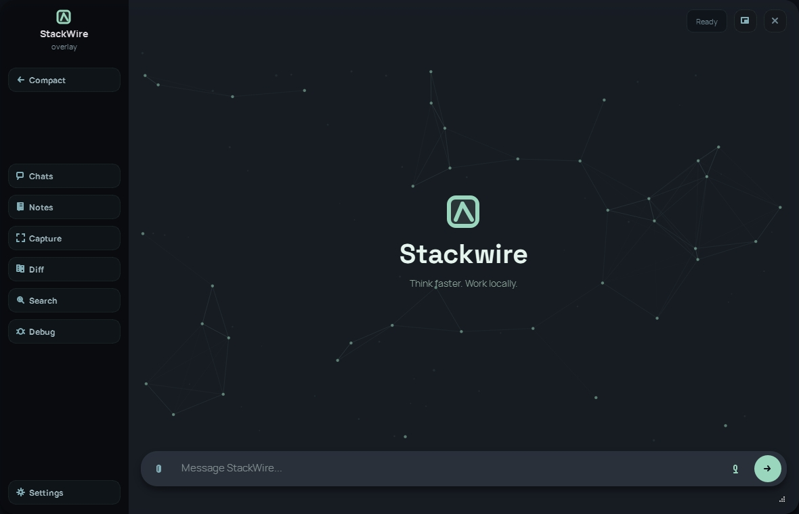
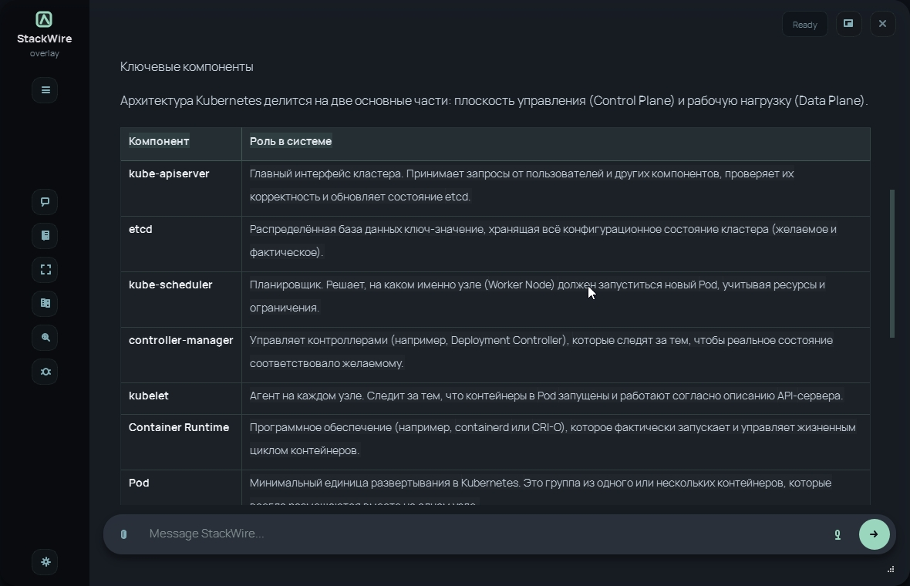
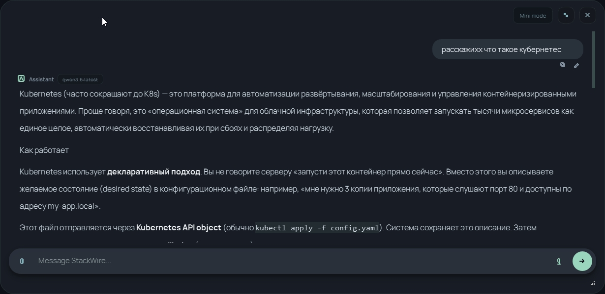
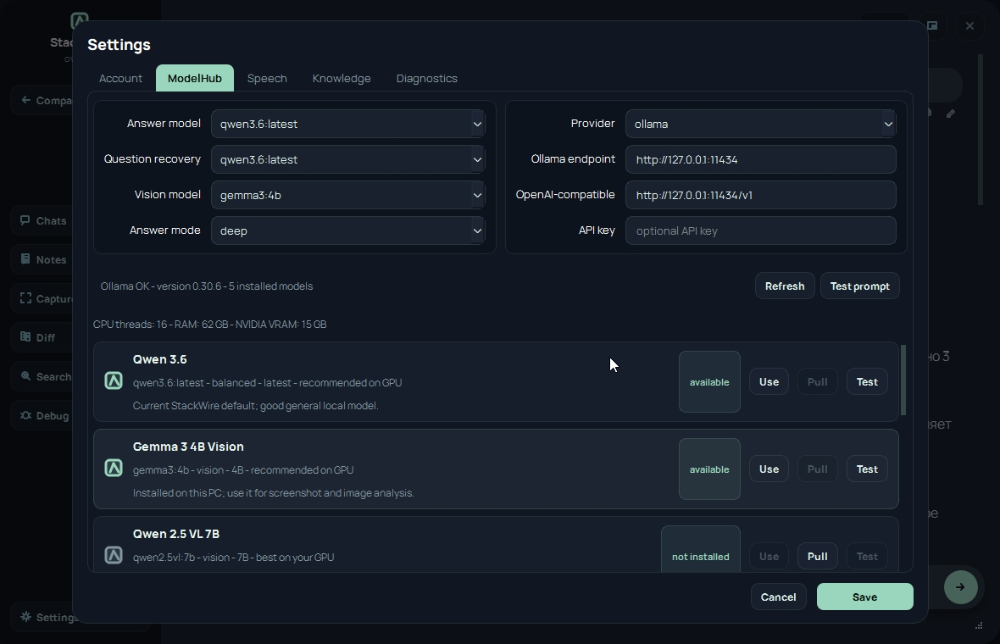

# StackWire

Local AI workspace.

  

## Features

RU/ENG language switch

- Whisper-based speech-to-text
- Question recovery from noisy transcripts
- Local RAG over Markdown knowledge notes
- Answer planning and validation
- SQLite session history and saved answers
- PySide6 desktop client
- FastAPI backend
- Ollama-compatible local LLM backend

<b>Screenshots</b>

 

