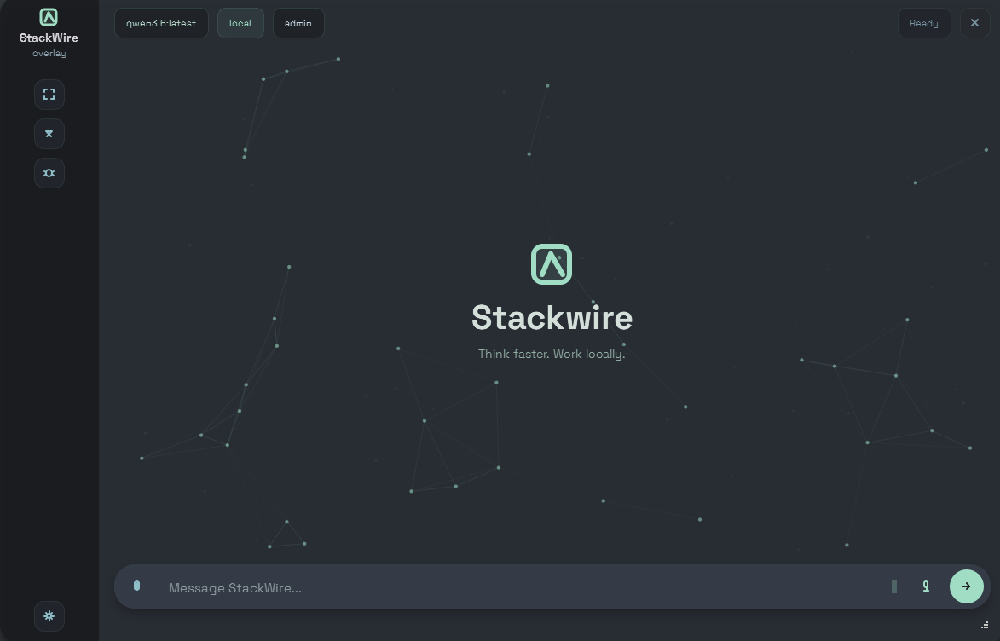
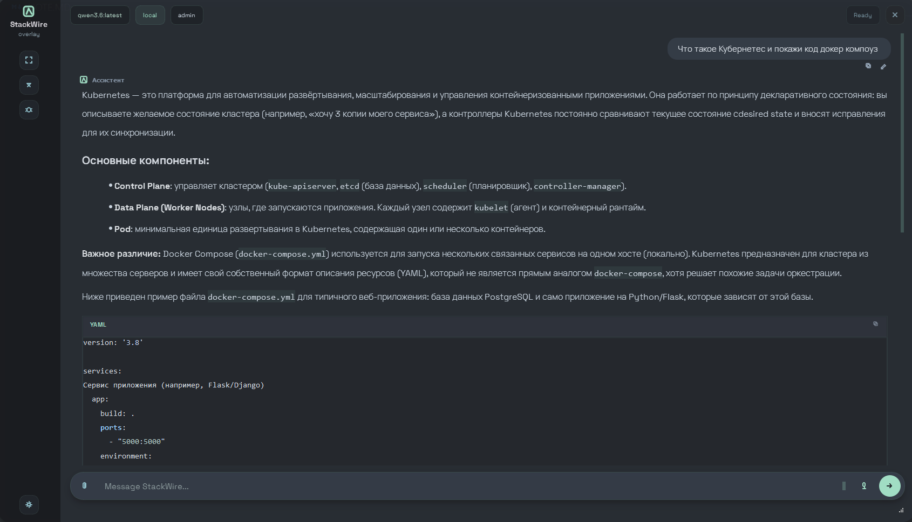

# StackWire

Technical knowledge assistant for DevOps/SRE professionals. Combines speech-to-text, question recovery, retrieval-augmented generation (RAG), and intelligent answer generation to provide production-oriented technical responses.

## Key Features

- **Speech-to-Text (STT)**: Whisper-based transcription with recovery from recognition errors
- **Question Recovery**: Denoise and reconstruct questions from imperfect speech recognition
- **RAG System**: Local knowledge base retrieval for context-aware answers
- **Answer Planning**: Domain-specific response strategies
- **Answer Validation**: Ensures responses follow technical correctness contracts
- **Desktop Client**: PySide6 GUI with syntax highlighting, image analysis, and session management
- **REST API**: FastAPI backend for remote deployments

## Architecture

- **Server**: FastAPI application handling STT, question recovery, answer generation, and storage
- **Client**: Desktop GUI (Windows/Linux) with local Whisper transcription option
- **Storage**: SQLite database for session history, feedback, and good answer examples
- **LLM Backend**: Ollama integration for local model execution

## Configuration

Server IP is configured in `stackwire.local.env`:

```env
SERVER_IP=[IP]
SERVER_PORT=8000
OLLAMA_URL=http://127.0.0.1:11434/api/chat
OLLAMA_MODEL=qwen3.6:latest
WHISPER_MODEL=large-v3-turbo
```

Configuration file is in `.gitignore` for per-machine customization.

## Setup

### Screenshots




### Running

Start server on main machine:

```bat
start_server.bat
```

Start client:

```bat
start_client.bat
```

Override server IP without editing config:

```bat
start_client.bat [IP]
```

## Development

- **Python 3.10+**
- Dependencies: `requirements.txt`
- Tests in `tests/` directory
- Knowledge base in `docs/knowledge/`
